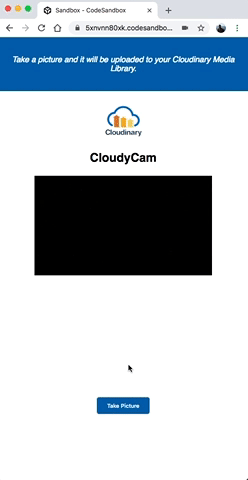

# Cloudy Cam

An offline Progressive Web Application (PWA) camera app with React and Cloudinary

- 

- 

[Link to Tutorial](https://dev.to/ore/building-an-offline-pwa-camera-app-with-react-and-cloudinary-5b9k)

## Setup

### Clone the repository
```
git clone https://github.com/oreHGA/cl-react-pwa.git
```

### Install node modules
```
yarn
```

### Update Env
```
cp .env.example .env
```

- Edit the `.env` file with your Cloudinary Credentials. Sign Up for a Cloudinary account [here](https://cloudinary.com/signup)

### Run - Development
```
yarn start
```

- Navigate to local developement server (usually `https://localhost:3000`)

### Run - Production
```
yarn build
yarn global add serve
serve -s build
```

- Navigate to static production server (usually `http://localhost:5000`)
